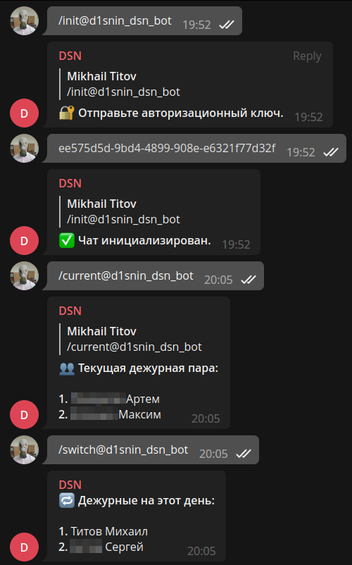

[](https://wakatime.com/badge/user/e4446807-0aa6-4ba9-92ea-2a7632bc44c9/project/702fa278-ec20-4b56-9552-bf1387ffec62)
[](https://opensource.org/licenses/Apache-2.0)
[](https://github.com/d1snin/dsn/actions/workflows/gradle.yml)

### dsn

Данный проект реализует достаточно примитивную логику и используется
только в моих локальных кругах. Приложение запускается на серверной
машине и использует Телеграм-бота для оповещения студентов моей
группы о том, кто сегодня дежурит, так что мне не приходится лезть
в журнал каждое божье утро.



### Содержание

- [Фичи](#Фичи)
- [Конфигурация](#Конфигурация)
- [Запуск](#Запуск)
- [Использование](#Использование)
- [Поведение](#Поведение)
- [лицензия](#Лицензия)

### Фичи

- Удобный UI/UX в виде Телеграм-бота. Доступ к мутирующим
  командам имеет только владелец группы.
- Автоматическое оповещение о дежурных по cron-джобе.
  Cron-выражение настраивается. Возможность отключения
  оповещений присутствует.
- Возможность переключить дежурных через команду.
- Возможность просмотреть все дежурные пары и текущую пару.
- Возможность запланировать дежурство текущей пары на следующую
  итерацию.

### Конфигурация

Приложение конфигурируется через `.env` файл, который
загружается в переменные среды.

Откройте `.env.tmp` и начните редактировать конфиг.

Доступны следующие переменные среды:

| Переменная                            | Описание                                                                   |
|---------------------------------------|----------------------------------------------------------------------------|
| `DSN__REDIS__ENDPOINT`                | Адрес Redis-сервера вида `<host>:<port>`.                                  |
| `DSN__BOT__TOKEN`                     | Токен Telegram-бота.                                                       |
| `DSN__BOT__USER_AUTHENTICATION_TOKEN` | Токен авторизации пользователя. Любой набор символов.                      |
| `DSN__ANNOUNCING__CRON`               | Cron-выражение по которому срабатывает джоба объявления новых дежурных.    |
| `DSN__DUTY_PAIRS`                     | Дежурные пары. Формат следующий: `student_1,student_2;student_3,student_4` |

Сохраните файл как `.env`, отбросив окончание `.tmp`.

### Запуск

Приложение запускается с использованием Docker Compose:

```shell
./gradlew installDist
docker-compose -f ./docker/docker-compose.yml up --build
```

Конфигурация располагается в директории `./docker`

### Использование

Команды бота имеют описание и интуитивно понятны. 
Приложение поддерживает только одну инициализированную чат-группу.
Инициализировать можно только групповой чат.
Привилегированным пользователем становится тот, кто инициализировал чат командой `/init`.
Привилегированный пользователь вправе использовать мутирующие команды.

### Поведение

Обратитесь к документу на английском языке: [CODE_OF_CONDUCT.md](./CODE_OF_CONDUCT.md)

### Лицензия

```
   Copyright 2022-2023 Mikhail Titov

   Licensed under the Apache License, Version 2.0 (the "License");
   you may not use this file except in compliance with the License.
   You may obtain a copy of the License at

       http://www.apache.org/licenses/LICENSE-2.0

   Unless required by applicable law or agreed to in writing, software
   distributed under the License is distributed on an "AS IS" BASIS,
   WITHOUT WARRANTIES OR CONDITIONS OF ANY KIND, either express or implied.
   See the License for the specific language governing permissions and
   limitations under the License.
```
